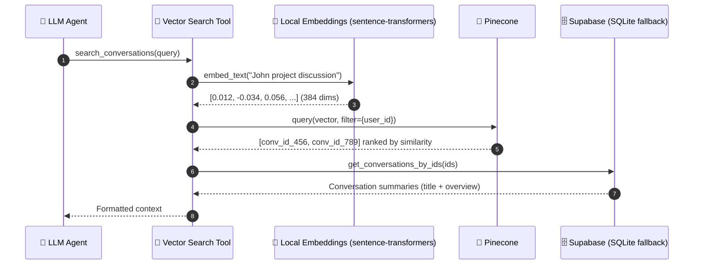

# reSpeaker Clip AI Agent

A voice-first AI assistant built on **Flask + LangGraph + Groq**. You speak (or type), the agent routes the request, decides which tools to use, answers, and speaks the reply back to you.

The architecture follows an Omi-style chat system: a LangGraph router classifies each request, the agentic branch gives the LLM access to tools, and a vector store lets the agent search your own past conversations.

## Features

- **Voice in / voice out** — Groq Whisper (STT) + Groq Orpheus (TTS)
- **Text chat with SSE streaming** — tokens stream live, then the answer is spoken (TTS)
- **LangGraph router** — three branches: `simple`, `agentic` (tools), `persona`
- **Tools (hybrid)**: local tools — web search (Tavily), calculator, conversation vector search (Pinecone), FMP finance (5), Shopify Global Catalog / UCP buyer flow (8) — plus a **Composio gateway** (`search → execute → connect`) for external apps (Gmail, Google Calendar, Slack, Linear, GitHub, Trello, Asana, Notion, ...)
- **Long-term memory** — Mem0 (proactive recall + post-turn extraction)
- **Conversation history** — last 10 turns per conversation
- **Storage**: Supabase PostgreSQL (with a SQLite fallback for development/tests)

## Architecture

```
                    Browser (mic + chat UI)
                            │
                            ▼
                          Flask
                            │
              ┌─────────────┼─────────────┐
              │             │             │
              ▼             ▼             ▼
          SIMPLE        AGENTIC        PERSONA
                           │
              ┌────────────┼───────────────┐
              │            │               │
              ▼            ▼               ▼
        Local tools   search_conversations  Composio gateway
   (web_search,            │          (composio_search /
    calculator, FMP,       ▼           composio_execute /
    Shopify UCP)       Pinecone        composio_connect)
              │        ◄── embeddings      │
              │            │               ▼
              └────┬───────┘          Gmail, Calendar,
                   ▼                  Slack, Linear, ...
                 Groq LLM
                   │
        ┌──────────┴──────────┐
        ▼                     ▼
      Mem0 (memory)       Supabase (conversations)
        │                     │
        └──────────┬──────────┘
                   ▼
                response
                   │
         ┌──────────┴──────────┐
         ▼                     ▼
    TTS (audio)           SSE (text)
```

### Tool architecture (hybrid)

The agent's capabilities are split into three layers:

1. **Lifecycle capabilities** (not tools): Mem0 proactive recall before each
   turn and post-turn memory save, the last-10-turns conversation history,
   Supabase/SQLite persistence, and asynchronous conversation summarization ->
   embedding -> Pinecone indexing.
2. **Local tools** — always registered, each degrading gracefully when its key
   is missing: `web_search` (Tavily), `calculator`, `search_conversations`
   (Pinecone + DB join), 5 FMP finance tools, and 8 Shopify Global Catalog /
   UCP buyer-flow tools.
3. **Composio external-app gateway** — `composio_search` -> `composio_execute`
   -> `composio_connect`, added only when `COMPOSIO_API_KEY` is set. Gmail,
   Google Calendar, Slack, Linear, GitHub, Trello, Asana, Notion and other
   external apps are reached only through this gateway; their old direct
   integration modules are kept on disk but are not registered as tools. Only
   selected toolkits are searchable (default: `github`), and Connect URLs are
   surfaced only through the frontend Connect button.

### reSpeaker Clip audio input

The browser can be replaced (or complemented) by a **reSpeaker Clip** worn device. A
`ClipRuntime` runs on a dedicated asyncio daemon thread inside Flask and owns exactly
**one long-lived BLE connection** to the Clip:

- A background supervisor connects by `CLIP_BLE_ADDRESS` (or scans `CLIP_BLE_NAME`),
  sends a status heartbeat every `CLIP_STATUS_INTERVAL`, and reconnects with
  1/2/4/8/16/30 s jittered backoff. Only the supervisor connects/reconnects.
- Firmware `state` events and GSTAT polling reconcile to one recording state, so a
  physical button press or a missed event during a disconnect is still handled.
- A stopped session automatically enters an **ingestion workflow**:
  `download (Ogg .opus packets) → re-container to one Ogg Opus file → Groq Whisper →
  shared LangGraph pipeline`. Progress is persisted in a `clip_ingestions` table
  (SQLite and/or Supabase) keyed by `(device_id, session_id)`; repeated events and
  HTTP retries never duplicate work, and the very first integration baseline marks
  pre-existing device sessions `ignored_existing`.
- The shared `AudioService` processes both browser bytes (`POST /api/voice`) and Clip
  Ogg files so STT → LangGraph → persistence/memory → TTS is identical for each.
- **RTC live streaming (warm pause)** — as soon as the device connects, the runtime
  auto-arms one RTC session (`AT+START=rtc` → stream → `AT+PAUSE`). BLE, the RTC
  session, the `StreamReceiver` and its file-frame lease stay alive for the whole
  process; while paused **no BLE audio frames flow** (the firmware mic pipeline
  stays warm). Each `RESUME → PAUSE` interval is one *logical utterance*: a physical
  double-click or the web button drives it, rolling partial transcripts render in
  near real time, and a final authoritative transcription is sent exactly once
  through the shared `AudioService.process_transcript` pipeline. RTC sessions are
  never written to SD and never enter the download/ingestion workflow.

### Conversation vector search flow

When you ask a question about a past conversation, the agent calls the `search_conversations` tool, which embeds the query, finds matching conversations in Pinecone, and pulls their summaries from Supabase:



## Tech stack


| Area              | Technology                                  |
| ----------------- | ------------------------------------------- |
| Backend           | Flask, LangGraph, LangChain agents          |
| LLM / STT / TTS   | Groq (LLM, Whisper, Orpheus TTS)            |
| Router            | LangGraph (simple / agentic / persona)      |
| Web search        | Tavily (local tool)                          |
| Finance           | Financial Modeling Prep (local, 5 tools)     |
| Commerce          | Shopify UCP buyer flow (local, 8 tools)      |
| External apps     | Composio gateway (Gmail, Calendar, Slack, Linear, GitHub, ...) |
| Long-term memory  | Mem0                                        |
| Relational store  | Supabase PostgreSQL (SQLite fallback)       |
| Vector store      | Pinecone (cosine)                           |
| Embeddings        | `sentence-transformers` `all-MiniLM-L6-v2` (local, 384-dim) |

## Prerequisites

- Python 3.10+
- A **Groq API key** (required — powers LLM, STT, TTS)
- **reSpeaker Clip** (optional but recommended voice input). The `respeaker-clip-sdk[ble]` package (with `bleak`) is pinned in `requirements.txt` from the **rayheto fork** of `reSpeaker_Clip` at commit `a146061b` (`subdirectory=sdk`) — the upstream Seeed pin `93f8667` has no RTC streaming (`clip.stream` / `start_rtc`). BLE needs a Linux/Windows host with Bluetooth (bluez on Linux).
- Optional API keys (each feature degrades gracefully if missing):
  - **Tavily** — web search tool
  - **Financial Modeling Prep (FMP)** — finance tools (quotes, profiles, statements, news)
  - **Shopify** — Global Catalog / UCP buyer flow (catalog, cart, order tools)
  - **Composio** — external-app gateway (Gmail, Calendar, Slack, Linear, GitHub, ...); optional, app keeps running without it
  - **Mem0** — long-term memory
  - **Supabase** — conversation storage (falls back to SQLite)
  - **Pinecone** — conversation vector search

## Quick start

```bash
# 1. Clone and enter the project
git clone https://github.com/KasunThushara/reSpeaker-Clip-AI-Agent.git
cd reSpeaker-Clip-AI-Agent

# 2. Create and activate a virtual environment
python -m venv .venv
.venv\Scripts\activate        # Windows
source .venv/bin/activate     # macOS / Linux

# 3. Install dependencies
pip install -r requirements.txt

# 4. Create your environment file
cp .env.example .env          # then fill in your keys (see Configuration)

# 5. Run the server
python app.py
```

Open http://localhost:5000. The input depends on `VOICE_INPUT_MODE`:

- **`both`** (default, development) — manual selector between **reSpeaker Clip** and the browser mic.
- **`clip`** (production) — Clip only; no `getUserMedia`, the web button calls the Clip start/stop APIs and the Clip physical button works the same way.
- **`browser`** — legacy system-mic push-to-talk only.

With an armed RTC session the Clip web button is **Resume/Pause** (it maps to
`POST /api/clip/stream/resume` / `.../pause`), and the physical device double-click
drives the same warm-pause utterances. Both render near-real-time partial
transcripts and the final answer, and play the reply through `/api/tts`. Starting a
new utterance does not wait for the previous answer; a new utterance pauses any
in-flight TTS. Clip control is disabled while the device is offline.

## Configuration

Copy `.env.example` to `.env` and fill in the values. Only `GROQ_API_KEY` is strictly required.

| Variable                | Default                    | Purpose                              |
| ----------------------- | -------------------------- | ------------------------------------ |
| `GROQ_API_KEY`          | —                          | Groq LLM / STT / TTS                 |
| `GROQ_LLM_MODEL`        | `qwen/qwen3.6-27b`         | Main LLM (router, simple, persona)   |
| `GROQ_AGENT_MODEL`      | `openai/gpt-oss-20b`       | Agent (tool-calling) LLM             |
| `GROQ_STT_MODEL`        | `whisper-large-v3`         | Speech-to-text                       |
| `GROQ_TTS_MODEL`        | `canopylabs/orpheus-v1-english` | Text-to-speech                  |
| `TTS_VOICE`             | `autumn`                   | TTS voice                            |
| `STT_PROMPT`            | *(domain terms)*           | Whisper vocabulary hint              |
| `STT_LANGUAGE`          | `en`                       | STT language                         |
| `DATABASE_URL`          | `sqlite:///chat.db`        | SQLite fallback DB path              |
| `TAVILY_API_KEY`        | —                          | Web search tool                      |
| `FMP_API_KEY`            | —                          | Finance tools (quotes, profiles, statements, news) |
| `COMPOSIO_API_KEY`       | —                          | Composio gateway; empty disables it  |
| `COMPOSIO_TOOLKITS`      | `github`                   | Toolkits searchable via the gateway (comma-separated) |
| `SHOPIFY_ACCESS_TOKEN`  | —                          | Optional Shopify buyer-linked token |
| `SHOPIFY_AGENT_PROFILE` | Shopify example profile   | UCP agent profile URL                |
| `SHOPIFY_CLIENT_ID`      | —                          | Order MCP client credentials         |
| `SHOPIFY_CLIENT_SECRET`  | —                          | Order MCP client credentials         |
| `MEM0_API_KEY`          | —                          | Long-term memory                     |
| `MEM0_USER_ID`          | `user-1`                   | Mem0 memory scope                    |
| `NOTION_API_KEY`        | —                          | Legacy direct Notion module (kept, not registered) |
| `NOTION_DATABASE_ID`    | —                          | Legacy direct Notion module (kept, not registered) |
| `USER_ID`               | `user-1`                   | Single-user id across the system     |
| `SUPABASE_URL`          | —                          | Supabase project URL                 |
| `SUPABASE_KEY`          | —                          | Supabase service-role key            |
| `PINECONE_API_KEY`      | —                          | Pinecone vector store                |
| `PINECONE_INDEX_NAME`   | `conversations`            | Pinecone index name                  |
| `PINECONE_REGION`       | `us-east-1`                | Pinecone serverless region           |
| `EMBEDDING_MODEL`       | `all-MiniLM-L6-v2`         | Local embedding model                |
| `VOICE_INPUT_MODE`      | `both`                     | `clip` / `both` / `browser`          |
| `CLIP_BLE_ADDRESS`      | —                          | Clip BLE address (else scan by name) |
| `CLIP_BLE_NAME`         | `Clip`                     | BLE name substring to scan for       |
| `CLIP_RECORD_MODE`      | `enhanced`                 | `normal` or `enhanced`               |
| `CLIP_STATUS_INTERVAL`  | `5`                        | Status heartbeat seconds             |
| `CLIP_DOWNLOAD_TIMEOUT` | `300`                      | Per-session download timeout (s)     |
| `CLIP_TEMP_DIR`         | `clip_audio`               | Local temp audio dir                 |
| `CLIP_MAX_FAILED_ARTIFACTS` | `5`                   | Bounded failed-artifact retention    |
| `AGENT_ENABLED`            | `true`                | `false` = device gateway (no agent, no STT; audio over HTTP) |
| `RTC_AUTO_ARM`             | `true`                | Auto-arm the RTC session on connect  |
| `RTC_ARM_TIMEOUT`          | `15`                  | Bounded wait for the RTC stream start|
| `RTC_SETTLE_SECONDS`       | `1.0`                 | Ignore stale initial state events    |
| `RTC_PARTIAL_INTERVAL`     | `2.0`                 | Rolling partial STT interval (s)     |
| `RTC_PARTIAL_MIN_FRAMES`   | `25`                  | Min frames before a partial upload   |
| `RTC_MIN_UTTERANCE_FRAMES` | `25`                  | Shorter utterances skip the LLM      |
| `RTC_MAX_UTTERANCE_FRAMES` | `180000`              | Hard bound on frames per utterance   |
| `RTC_PRE_ROLL_FRAMES`      | `15`                  | Tentative first-frame pre-roll ring  |
| `RTC_MAX_PENDING_FINALIZE` | `16`                  | Bounded FIFO of finalize jobs        |
| `GROQ_RTC_PARTIAL_MODEL`   | `whisper-large-v3-turbo` | Partial transcription model       |
| `GROQ_RTC_FINAL_MODEL`     | `whisper-large-v3`    | Authoritative final transcription    |

### Optional one-time setup

**Supabase (conversation storage):**
1. Create a Supabase project, copy `SUPABASE_URL` + the service-role key into `.env`.
2. Open the **SQL Editor** and run `supabase_schema.sql` (creates the conversation tables plus `clip_ingestions`/`clip_device_state`, and seeds `user-1`).

If Supabase is not configured, the app falls back to SQLite (`chat.db`).

**Composio (external-app gateway):**
1. Create an account at composio.dev, put the API key into `.env` as `COMPOSIO_API_KEY`.
2. `COMPOSIO_TOOLKITS` (default `github`) lists which toolkits the agent may discover; only selected toolkits are searchable. The selection can be changed from the Tools panel in the UI and is persisted across restarts.
3. When `COMPOSIO_API_KEY` is absent the gateway is disabled and the app runs with the local tools only (graceful fallback). Connect/auth URLs are surfaced only through the frontend Connect button, never in chat text.

**FMP (finance tools):**
Paste an `FMP_API_KEY` from https://site.financialmodelingprep.com into `.env`.

**Shopify (Global Catalog + UCP buyer flow):**
The catalog and cart tools use Shopify UCP and work without client credentials;
`SHOPIFY_ACCESS_TOKEN` is an optional buyer-linked token and
`SHOPIFY_AGENT_PROFILE` identifies the agent. Configure
`SHOPIFY_CLIENT_ID`/`SHOPIFY_CLIENT_SECRET` only for `shopify_get_order`.

**Pinecone (conversation search):**
Paste your key into `.env`. On startup the app auto-creates the `conversations` index (384-dim, cosine) and indexes each conversation asynchronously after every turn.

## API endpoints

| Method | Endpoint          | Description                                        |
| ------ | ----------------- | -------------------------------------------------- |
| GET    | `/api/health`     | Health check                                       |
| POST   | `/api/chat`       | Text chat → JSON `{response, conversation_id}`     |
| POST   | `/api/chat/stream`| Text chat → SSE (`thinking`, `token`, `done`)      |
| POST   | `/api/voice`      | Audio → STT → chat → TTS → `audio/wav`             |
| POST   | `/api/tts`        | `{text}` → `audio/wav`                             |
| GET    | `/api/clip/status`| Clip connection/recording status                   |
| GET    | `/api/clip/events`| SSE: `connection`, `recording`, `workflow`, `result`, `rtc_state`, `transcript` |
| POST   | `/api/clip/recordings/start` | `{mode?, conversation_id?}` start recording |
| POST   | `/api/clip/recordings/stop`  | Stop, returns accepted/session workflow data |
| POST   | `/api/clip/stream/resume`    | Resume the armed RTC session (next utterance) |
| POST   | `/api/clip/stream/pause`     | Warm-pause the RTC session (finalize utterance) |
| POST   | `/api/clip/sessions/<session_id>/ingest` | Idempotent retry/enqueue of a session |
| GET    | `/api/clip/sessions/<session_id>/audio` | Retained session Ogg (device gateway) |
| GET    | `/api/clip/utterances/<session_id>/<utterance_id>/audio` | Retained utterance Ogg (device gateway) |
| POST   | `/api/clip/context`| `{conversation_id}` register the active conversation |
| GET    | `/api/composio/toolkits` | List available + selected Composio toolkits   |
| POST   | `/api/composio/toolkits` | `{toolkits: [...]}` — set and persist selection |
| GET    | `/api/composio/auth/status` | `?toolkit=` — is the toolkit connected?  |
| GET    | `/api/composio/auth/connected` | List of connected toolkits             |
| GET    | `/api/composio/connect/link` | Lazily-cached connect link (frontend)    |

Clip error mapping: `400` bad input, `409` state conflict (e.g. already recording),
`502` command/transfer failure, `503` device unavailable / reconnecting.

Clip SSE events:

```
event: connection  data: {"connected": true, "status": {...}}
event: recording   data: {"action": "started|stopped", "session": "...", "trigger": "web|physical"}
event: workflow    data: {"status": "stopped|downloading|processing|failed", "session": "..."}
event: result      data: {"session": "...", "conversation_id": "...", "transcript": "...", "response": "...", "trigger": "rtc"}
event: rtc_state   data: {"phase": "arming|paused|capturing|finalizing|stopped|disconnected", "session": "...", "utterance_id": 4, "trigger": "web|device"}
event: transcript  data: {"utterance_id": 4, "text": "...", "final": false|true}
```

Agent mode additionally emits `thinking` and `token` while the reply streams; with
`AGENT_ENABLED=false` (device gateway) no transcript is produced and the audio is
announced instead:

```
event: utterance_audio data: {"utterance_id": 4, "session": "...", "url": "/api/clip/utterances/<session>/4/audio", "bytes": 41216, "content_type": "audio/ogg", "trigger": "device"}
event: session_audio   data: {"session": "...", "url": "/api/clip/sessions/<session>/audio", "bytes": 80128, "trigger": "physical"}
```

An utterance too short to keep arrives as `{"utterance_id": 4, "skipped": "too short"}`.

SSE event format:

```
event: thinking   data: {"tool": "web_search"}
event: token      data: {"text": "The"}
event: done       data: {"response": "...", "conversation_id": "..."}
```

## Testing

```bash
pytest
```

Clip-related tests use a fake BLE transport / fake worker and a local SQLite
database — no real hardware or BLE is required. They cover serialized command
lifecycle, timeout-then-reconnect, backoff, no heartbeat during download, web
START/STOP, physical state events, reconnect reconciliation, first-start baseline,
idempotent ingestion, raw Opus→Ogg fixtures (including corrupt/truncated input), and
API status/error mappings. RTC tests (with fake protocol frames) additionally cover:
auto-arm command order, physical `STREAMING`/`PAUSED` and web resume/pause, 25
repeated cycles without disconnect, exactly-once finalization under event races,
stale-lease cleanup safety, BLE-loss re-arm, RTC never entering SD ingestion,
bounded frame admission, partial revision/stale suppression, exactly one
`process_transcript` per utterance, and next-capture-during-LLM decoupling.

Tests use the SQLite fallback, so no external services are needed to run them.
Registry tests verify the hybrid tool set (16 local tools when Composio is
disabled, 19 with the 3 Composio wrappers when configured, no duplicates,
stable ordering); prompt tests verify the hybrid routing and safety wording.

## Project structure

```
app.py                       # Flask factory + dev server
config.py                    # Settings from .env
pyproject.toml               # Python distribution (console script respeaker-clip-service)
supabase_schema.sql          # Supabase table schema (run in SQL Editor)
packages/
  respeaker-clip/            # npm package: TS client SDK + Python service runner CLI
frontend/
  templates/index.html       # UI (mic + text chat)
  static/js/app.js           # MediaRecorder + SSE consumer
backend/
  service_cli.py             # `python -m backend.service_cli` (used by the npm CLI)
  clip/
    runtime.py               # BLE runtime: connection supervisor, RTC warm-pause utterances
    worker.py                # asyncio daemon-thread façade for Flask
    store.py                 # clip_ingestions persistence (SQLite/Supabase)
    transfer.py              # Ogg packet download + streaming receiver
    ogg.py                   # Raw Opus → Ogg Opus re-container (file and in-memory)
    exceptions.py            # Clip error hierarchy mapped to HTTP statuses
  llm/
    client.py                # Groq LLM clients (llm, agent_llm)
    embeddings.py            # Local sentence-transformers embedding
    stt.py                   # Groq Whisper + domain corrections
    tts.py                   # Groq Orpheus (clean + truncate)
  graph/
    state.py                 # AgentState TypedDict
    router.py                # simple / context / persona + keyword pre-check
    graph.py                 # LangGraph StateGraph
    nodes/
      simple.py              # No-tool LLM response
      agentic.py             # create_agent with tools
      persona.py             # Styled LLM response
  tools/
    registry.py              # get_available_tools() — local tools + Composio gateway
    search.py                # Tavily web search
    calculator.py            # Safe expression evaluator
    conversation_search.py   # Search past conversations (Pinecone)
    finance.py               # FMP finance tools (quotes, profile, statements, news)
    shopify.py               # Shopify Global Catalog + UCP buyer flow (8 tools)
    composio.py              # Composio gateway wrappers (search/execute/connect)
    notion.py                # Legacy direct Notion module (kept, not registered)
  database/
    chat.py                  # DB facade (Supabase + SQLite fallback)
    supabase_client.py       # Supabase client
  memory/
    client.py                # Mem0 recall / save / format
  services/
    conversation_service.py  # Async summarize + embed + index
  vector/
    pinecone.py              # Pinecone upsert / search
  routes/
    chat.py                  # /api/chat + /api/chat/stream (SSE)
    voice.py                 # /api/voice
    clip.py                  # /api/clip/* (status, events, recordings, stream, ingest)
    composio.py              # /api/composio/* toolkit selection + auth status
    google_auth.py           # Legacy direct Google OAuth module (not registered)
    tts.py                   # /api/tts
    health.py                # /api/health
```

## Adding a new tool

1. Create a module in `backend/tools/`, e.g. `my_tool.py`, defining a `@tool` function:
   ```python
   from langchain_core.tools import tool

   @tool
   def my_tool(query: str) -> str:
       """Describe when the agent should call this tool."""
       return "result"
   ```
2. Add it to `backend/tools/registry.py` `get_available_tools()`.
3. (Optional) Mention it in the agent system prompt in `backend/graph/nodes/agentic.py`.

The agent (Groq `gpt-oss-20b` or whichever `GROQ_AGENT_MODEL`) then decides autonomously when to use it.

## Packaging & distribution

The Clip service ships in two installable forms, both driven from one npm
package, [`packages/respeaker-clip`](packages/respeaker-clip) (`respeaker-clip`):

```bash
npm install respeaker-clip                        # typed client SDK
npx respeaker-clip serve --source .                # create a venv, install, run this service
npx respeaker-clip doctor                          # node / python / venv / bluez checks
npx respeaker-clip status --base-url http://localhost:5000
```

- **Client SDK** — zero-dependency TypeScript: `ClipClient` (REST + SSE with
  `Last-Event-ID` reconnect) and `RtcSessionController` (folds `rtc_state`,
  `transcript`, `thinking`, `token` and `result` into one renderable utterance
  state machine). Works in the browser and in Node ≥ 18.17. `npm test` runs its
  `node:test` suite.
- **Service runner** — the Clip service itself is Python. The CLI resolves a
  service source (`--source`, or the `respeaker-clip-service` pip distribution),
  creates a dedicated virtualenv, installs into it, and launches
  `python -m backend.service_cli`, forwarding `--host/--port/--input-mode` and
  the rest of the environment. It reads a `.env` from the directory it runs in
  (or `--env-file`), and real environment variables take precedence.
- **Device gateway mode** — `respeaker-clip serve --no-agent` runs the Clip
  runtime and its API only: the agent stack is never imported, no
  `GROQ_API_KEY` is needed, and each finalized utterance / downloaded session is
  re-containerized to Ogg and served over HTTP (`utterance_audio` and
  `session_audio` events) instead of being transcribed and answered.
- **Deployment guide** — systemd unit, BLE/D-Bus permissions, nginx for the SSE
  stream, security notes (the API has no auth and CORS is open), upgrades and a
  troubleshooting table: [`packages/respeaker-clip/DEPLOYMENT.md`](packages/respeaker-clip/DEPLOYMENT.md)
  (中文版：[`DEPLOYMENT.zh-cn.md`](packages/respeaker-clip/DEPLOYMENT.zh-cn.md)).

The Python side has its own distribution metadata (`pyproject.toml`, console
script `respeaker-clip-service`, `python -m backend.service_cli`), so the service
can also be installed and run without Node:

```bash
pip install "respeaker-clip-service[clip] @ git+https://github.com/KasunThushara/reSpeaker-Clip-AI-Agent.git"
respeaker-clip-service --port 5000 --input-mode clip
```

Running from a pip install (rather than a checkout) serves the HTTP API only —
the bundled web UI in `frontend/` is not part of the wheel, and `/` then returns
a JSON index of the available endpoints.

## reSpeaker Clip integration guide

**BLE prerequisites (Linux):** install BlueZ (`sudo apt install bluez bluetooth`), make
sure the adapter is up (`bluetoothctl power on`), and confirm the Clip is pairable /
visible. On first boot of a Clip, long-press to enter BLE pairing if needed.

**SDK pin (RTC streaming):** `requirements.txt` installs `respeaker-clip-sdk[ble]` from
the **rayheto fork** of `github.com/rayheto/reSpeaker_Clip` at commit
`a146061b3820473f119dfaa7e8ac6791a48b9edb` (`subdirectory=sdk`). That commit is the
RTC live-streaming merge: stable `clip.ClipClient`/`clip.BleTransport` behavior plus
`ClipClient.start_rtc()`, `stream_rtc()`, `StreamReceiver`, and lease-token
`BaseTransport.detach_file_frame_handler()`. The upstream Seeed pin `93f8667` predates
RTC and was replaced for this feature; the fork tracks the same `dev` line.

**RTC warm pause (behavior contract):**
- One RTC session is armed after every baseline/recovery connect and **stays armed**:
  `AT+START=rtc` → `AT+DOWNLOAD` (STREAM_START) → `AT+PAUSE`. STOP stays terminal.
- Firmware state events map 1:1: `STREAMING` = capturing (resumed), `PAUSED` = warm
  pause ends the utterance, `IDLE` = terminal stop (detach; no re-arm until reconnect).
- While paused the device sends **no BLE audio frames**; the mic/DSP/Opus pipeline
  stays warm, so resume is low-latency. Rapid duplicate PAUSE/RESUME is idempotent
  and never wedges the state machine.
- Callbacks on the BLE receive path are O(1) (append + signal only); STT, Ogg
  packaging and the LLM run off-path. Rolling partials use cumulative in-memory Ogg
  snapshots (`GROQ_RTC_PARTIAL_MODEL`) with a bounded latest-wins policy; pause/stop
  creates one final Ogg snapshot and one authoritative final transcription
  (`GROQ_RTC_FINAL_MODEL`), then exactly one `AudioService.process_transcript` call.
  New utterances may start while the previous LLM pass is still running (FIFO).
- RTC sessions are never listed/persisted on the device and never enter the SD
  download/ingestion workflow; legacy recording is blocked with a clear conflict
  while the frame channel is owned by the RTC receiver.

**One process / one worker — keep the Flask reloader off.** The runtime owns a single
long-lived BLE connection per physical device plus one reconnect supervisor. `app.py`
runs with `use_reloader=False`; do not run multiple workers/processes that each create
a Clip connection to the same device. In development this means starting with
`python app.py` rather than a reloader-enabled flask command.

**Ergonomics around the protocol:**
- Commands are serialized; after a command timeout/protocol/connection failure the
  runtime disconnects and the supervisor recreates the connection before any next command.
- The heartbeat never issues commands while a download holds the operation lock.
- Downloads write `.part`, validate size/CRC32, and atomically publish (SDK behavior).
- Downloaded `NNNN.opus` files are `[u16le length][raw Opus frame]` packets — the
  project-local `backend.clip.ogg` module re-containers them into one valid Ogg Opus
  file (with session `sample_rate_hz`/`channels`) before Groq STT. Groq accepts `.ogg`.
- Only BLE control/downloads are used (no Wi-Fi handoff); device sessions are never
  deleted; successful temp audio is removed, failed artifacts are retained with bounded
  cleanup (`CLIP_MAX_FAILED_ARTIFACTS`).

**Input modes for deployment:** set `VOICE_INPUT_MODE=clip` in production so the
selector is hidden and no `getUserMedia` call is made; keep `both` for development.

## How the voice pipeline works

```
browser mic → WebM audio → POST /api/voice        ┐
                                                  ├─→ shared AudioService
Clip session (physical button or web click-to-toggle)│   (transcript → LangGraph
  → event/stop → download .opus → re-container    │    → response → save turn
  → Groq Whisper (STT)                             │    → memory → async index)
  → same AudioService pipeline                     ┘
  → Groq Orpheus (TTS) → audio/wav → browser speaker  (or /api/tts from result event)
```
