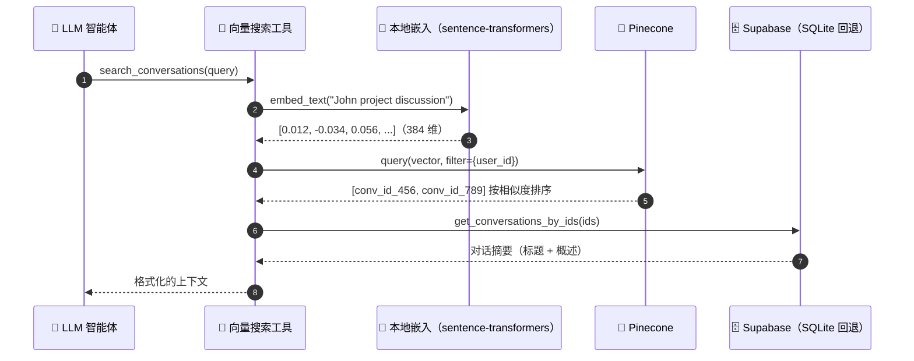

# reSpeaker Clip AI Agent

一个基于 **Flask + LangGraph + Groq** 的语音优先 AI 助手。你说话（或打字），智能体会路由请求、决定使用哪些工具、回答问题，并将回复语音播放给你。

架构遵循 Omi 风格的聊天系统：LangGraph 路由器对每个请求进行分类，智能体分支让 LLM 可以使用工具，向量存储让智能体可以搜索你过去的对话。

## 功能特性

- **语音输入 / 语音输出** — Groq Whisper（STT）+ Groq Orpheus（TTS）
- **带 SSE 流式传输的文本聊天** — token 实时流式传输，然后回答会被语音播放（TTS）
- **LangGraph 路由器** — 三个分支：`simple`、`agentic`（工具）、`persona`
- **工具（混合架构）**：本地工具 — 网页搜索（Tavily）、计算器、对话向量搜索（Pinecone）、FMP 金融（5 个）、Shopify Global Catalog / UCP 买家流程（8 个）— 外加 **Composio 网关**（`search → execute → connect`）用于外部应用（Gmail、Google 日历、Slack、Linear、GitHub、Trello、Asana、Notion 等）
- **长期记忆** — Mem0（主动召回 + 轮次后提取）
- **对话历史** — 每个对话保留最近 10 轮
- **存储**：Supabase PostgreSQL（开发和测试时可回退到 SQLite）

## 架构

```
                    浏览器（麦克风 + 聊天界面）
                            │
                            ▼
                          Flask
                            │
              ┌─────────────┼─────────────┐
              │             │             │
              ▼             ▼             ▼
          SIMPLE        AGENTIC        PERSONA
                           │
              ┌────────────┼───────────────┐
              │            │               │
              ▼            ▼               ▼
        Local tools   search_conversations  Composio 网关
   (web_search、           │          (composio_search /
    calculator、FMP、       ▼           composio_execute /
    Shopify UCP)       Pinecone        composio_connect)
              │        ◄── embeddings      │
              │            │               ▼
              └────┬───────┘          外部应用（Gmail、
                   ▼                   Calendar、Slack、
                 Groq LLM              Linear、GitHub 等）
                   │
        ┌──────────┴──────────┐
        ▼                     ▼
      Mem0（记忆）       Supabase（对话）
        │                     │
        └──────────┬──────────┘
                   ▼
                 响应
                   │
         ┌──────────┴──────────┐
         ▼                     ▼
    TTS（音频）           SSE（文本）
```

### 工具架构（混合）

智能体的能力分为三层：

1. **生命周期能力**（不是工具）：每轮对话前 Mem0 主动召回、轮次后记忆保存、最近 10 轮对话历史、Supabase/SQLite 持久化，以及异步的对话摘要 -> 嵌入 -> Pinecone 索引。
2. **本地工具** — 始终注册，缺失密钥时各自优雅降级：`web_search`（Tavily）、`calculator`、`search_conversations`（Pinecone + 数据库关联）、5 个 FMP 金融工具、8 个 Shopify Global Catalog / UCP 买家流程工具。
3. **Composio 外部应用网关** — `composio_search` -> `composio_execute` -> `composio_connect`，仅在配置 `COMPOSIO_API_KEY` 时添加。Gmail、Google 日历、Slack、Linear、GitHub、Trello、Asana、Notion 等外部应用只能通过该网关访问；旧的直连集成模块保留在磁盘上但不再注册为工具。只有被选中的工具包可被搜索（默认 `github`），Connect URL 只通过前端 Connect 按钮呈现。

### reSpeaker Clip 音频输入

可以用佩戴式 **reSpeaker Clip** 替代（或补充）浏览器麦克风。`ClipRuntime` 运行在 Flask 内部一个独立的 asyncio 守护线程中，并且对每台物理设备**只维护一条长期 BLE 连接**：

- 后台监督器按 `CLIP_BLE_ADDRESS` 连接（否则按 `CLIP_BLE_NAME` 扫描），每个 `CLIP_STATUS_INTERVAL` 发送一次状态心跳，并以 1/2/4/8/16/30 秒加抖动的退避机制重连。只有监督器负责连接/重连。
- 固件 `state` 事件与 GSTAT 轮询会收敛到同一个录音状态，因此物理按键或断连期间错过的事件也能被正确处理。
- 停止的会话会自动进入**摄取工作流**：`下载（Ogg .opus 包）→ 重封装为单个 Ogg Opus 文件 → Groq Whisper → 共享 LangGraph 流水线`。进度持久化在 `clip_ingestions` 表（SQLite 和/或 Supabase）中，键为 `(device_id, session_id)`；重复事件和 HTTP 重试不会重复处理；首次接入基线会把设备上已有会话标记为 `ignored_existing`。
- 共享的 `AudioService` 同时处理浏览器字节（`POST /api/voice`）和 Clip 的 Ogg 文件，确保 STT → LangGraph → 持久化/记忆 → TTS 完全一致。

### 对话向量搜索流程

当你询问关于过去对话的问题时，智能体会调用 `search_conversations` 工具，该工具会对查询进行向量化，在 Pinecone 中查找匹配的对话，并从 Supabase 中提取其摘要：



## 技术栈


| 领域              | 技术                                        |
| ----------------- | ------------------------------------------- |
| 后端               | Flask、LangGraph、LangChain agents          |
| LLM / STT / TTS   | Groq（LLM、Whisper、Orpheus TTS）          |
| 路由器             | LangGraph（simple / agentic / persona）     |
| 网页搜索           | Tavily（本地工具）                            |
| 金融               | Financial Modeling Prep（本地，5 个工具）     |
| 电商               | Shopify UCP 买家流程（本地，8 个工具）      |
| 外部应用           | Composio 网关（Gmail、日历、Slack、Linear、GitHub 等） |
| 长期记忆           | Mem0                                        |
| 关系型存储         | Supabase PostgreSQL（SQLite 回退）         |
| 向量存储           | Pinecone（余弦相似度）                      |
| 嵌入               | `sentence-transformers` `all-MiniLM-L6-v2`（本地，384 维） |

## 前置条件

- Python 3.10+
- **Groq API 密钥**（必需 — 驱动 LLM、STT、TTS）
- **reSpeaker Clip**（可选但推荐的语音输入）。`requirements.txt` 中固定安装了来自 **rayheto fork** 的 `reSpeaker_Clip` 提交 `a146061b` 的 `respeaker-clip-sdk[ble]`（含 `bleak`）——上游 Seeed 固定提交 `93f8667` 不包含 RTC 直播流（`clip.stream` / `start_rtc`）；BLE 需要 Linux/Windows 主机（Linux 需 bluez）。
- 可选 API 密钥（每个功能在缺失时会优雅降级）：
  - **Tavily** — 网页搜索工具
  - **Financial Modeling Prep（FMP）** — 金融工具（行情、公司简介、财报、新闻）
  - **Shopify** — Global Catalog / UCP 买家流程（商品目录、购物车、订单工具）
  - **Composio** — 外部应用网关（Gmail、日历、Slack、Linear、GitHub 等）；可选，缺失时应用照常运行
  - **Mem0** — 长期记忆
  - **Supabase** — 对话存储（回退到 SQLite）
  - **Pinecone** — 对话向量搜索

## 快速开始

```bash
# 1. 克隆并进入项目
git clone https://github.com/KasunThushara/reSpeaker-Clip-AI-Agent.git
cd reSpeaker-Clip-AI-Agent

# 2. 创建并激活虚拟环境
python -m venv .venv
.venv\Scripts\activate        # Windows
source .venv/bin/activate     # macOS / Linux

# 3. 安装依赖
pip install -r requirements.txt

# 4. 创建环境变量文件
cp .env.example .env          # 然后填入你的密钥（见配置说明）

# 5. 运行服务器
python app.py
```

打开 http://localhost:5000。输入方式取决于 `VOICE_INPUT_MODE`：

- **`both`**（默认，开发模式）— 手动在 **reSpeaker Clip** 与浏览器麦克风之间选择。
- **`clip`**（生产模式）— 仅 Clip；不调用 `getUserMedia`，网页按钮调用 Clip 的开始/停止 API，Clip 物理按键行为相同。
- **`browser`** — 仅使用旧的系统麦克风按住说话。

Clip 网页按钮为按住录音、松开停止；物理按键同样可以开始/停止录音。两种触发都会渲染转写文本/回答并通过 `/api/tts` 播放回复。设备离线或正在处理会话时 Clip 控件会被禁用。

## 配置

将 `.env.example` 复制为 `.env` 并填入值。只有 `GROQ_API_KEY` 是严格必需的。

| 变量                    | 默认值                     | 用途                                 |
| ----------------------- | -------------------------- | ------------------------------------ |
| `GROQ_API_KEY`          | —                          | Groq LLM / STT / TTS                 |
| `GROQ_LLM_MODEL`        | `qwen/qwen3.6-27b`         | 主 LLM（路由器、simple、persona）    |
| `GROQ_AGENT_MODEL`      | `openai/gpt-oss-20b`       | 智能体（工具调用）LLM               |
| `GROQ_STT_MODEL`         | `whisper-large-v3`         | 语音转文字                           |
| `GROQ_TTS_MODEL`         | `canopylabs/orpheus-v1-english` | 文字转语音                     |
| `TTS_VOICE`              | `autumn`                   | TTS 语音                             |
| `STT_PROMPT`             | *（领域术语）*             | Whisper 词汇提示                     |
| `STT_LANGUAGE`           | `en`                       | STT 语言                             |
| `DATABASE_URL`           | `sqlite:///chat.db`        | SQLite 回退数据库路径                |
| `TAVILY_API_KEY`         | —                          | 网页搜索工具                         |
| `FMP_API_KEY`             | —                          | 金融工具（行情、简介、财报、新闻）   |
| `COMPOSIO_API_KEY`       | —                          | Composio 网关；为空则禁用            |
| `COMPOSIO_TOOLKITS`      | `github`                   | 可通过网关搜索的工具包（逗号分隔）   |
| `SHOPIFY_ACCESS_TOKEN`   | —                          | 可选的 Shopify buyer-linked token    |
| `SHOPIFY_AGENT_PROFILE`  | Shopify 示例 profile       | UCP Agent profile URL                |
| `SHOPIFY_CLIENT_ID`      | —                          | 订单 MCP 客户端凭据                   |
| `SHOPIFY_CLIENT_SECRET`  | —                          | 订单 MCP 客户端凭据                   |
| `MEM0_API_KEY`           | —                          | 长期记忆                             |
| `MEM0_USER_ID`           | `user-1`                   | Mem0 记忆范围                         |
| `NOTION_API_KEY`         | —                          | 旧版直接 Notion 模块（保留但未注册）   |
| `NOTION_DATABASE_ID`     | —                          | 旧版直接 Notion 模块（保留但未注册）   |
| `USER_ID`                | `user-1`                   | 全系统单用户 ID                       |
| `SUPABASE_URL`           | —                          | Supabase 项目 URL                     |
| `SUPABASE_KEY`           | —                          | Supabase 服务角色密钥                 |
| `PINECONE_API_KEY`       | —                          | Pinecone 向量存储                     |
| `PINECONE_INDEX_NAME`    | `conversations`            | Pinecone 索引名称                     |
| `PINECONE_REGION`        | `us-east-1`                | Pinecone 无服务器区域                |
| `EMBEDDING_MODEL`        | `all-MiniLM-L6-v2`         | 本地嵌入模型                         |
| `VOICE_INPUT_MODE`       | `both`                     | `clip` / `both` / `browser`          |
| `CLIP_BLE_ADDRESS`       | —                          | Clip BLE 地址（否则按名称扫描）      |
| `CLIP_BLE_NAME`          | `Clip`                     | 扫描的 BLE 名称子串                  |
| `CLIP_RECORD_MODE`       | `enhanced`                 | `normal` 或 `enhanced`               |
| `CLIP_STATUS_INTERVAL`   | `5`                        | 状态心跳间隔（秒）                   |
| `CLIP_DOWNLOAD_TIMEOUT`  | `300`                      | 单会话下载超时（秒）                 |
| `CLIP_TEMP_DIR`          | `clip_audio`               | 本地临时音频目录                     |
| `CLIP_MAX_FAILED_ARTIFACTS` | `5`                     | 失败产物保留数量上限                 |

### 可选的一次性设置

**Supabase（对话存储）：**
1. 创建一个 Supabase 项目，将 `SUPABASE_URL` + 服务角色密钥复制到 `.env`。
2. 打开 **SQL 编辑器** 并运行 `supabase_schema.sql`（创建对话表以及 `clip_ingestions`/`clip_device_state`，并初始化 `user-1`）。

如果未配置 Supabase，应用会回退到 SQLite（`chat.db`）。

**Composio（外部应用网关）：**
1. 在 composio.dev 创建账号，将 API 密钥写入 `.env` 的 `COMPOSIO_API_KEY`。
2. `COMPOSIO_TOOLKITS`（默认 `github`）指定智能体可发现的工具包；只有被选中的工具包可被搜索。可在界面 Tools 面板中修改选择，选择会持久化保存并在重启后保留。
3. 未配置 `COMPOSIO_API_KEY` 时网关禁用，应用仅使用本地工具运行（优雅降级）。连接/授权 URL 只通过前端 Connect 按钮呈现，绝不出现在聊天文本中。

**FMP（金融工具）：**
将 https://site.financialmodelingprep.com 的 `FMP_API_KEY` 粘贴到 `.env`。

**Shopify（Global Catalog + UCP 买家流程）：**
商品目录和购物车工具通过 Shopify UCP 工作，不需要客户端凭据；
`SHOPIFY_ACCESS_TOKEN` 是可选的 buyer-linked token，`SHOPIFY_AGENT_PROFILE`
用于标识 Agent。仅 `shopify_get_order` 需要配置
`SHOPIFY_CLIENT_ID`/`SHOPIFY_CLIENT_SECRET`。

**Pinecone（对话搜索）：**
将你的密钥粘贴到 `.env`。启动时应用会自动创建 `conversations` 索引（384 维，余弦相似度），并在每轮对话后异步索引每个对话。

## API 端点

| 方法   | 端点              | 描述                                               |
| ------ | ----------------- | -------------------------------------------------- |
| GET    | `/api/health`     | 健康检查                                           |
| POST   | `/api/chat`       | 文本聊天 → JSON `{response, conversation_id}`      |
| POST   | `/api/chat/stream`| 文本聊天 → SSE（`thinking`、`token`、`done`）       |
| POST   | `/api/voice`      | 音频 → STT → 聊天 → TTS → `audio/wav`             |
| POST   | `/api/tts`        | `{text}` → `audio/wav`                             |
| GET    | `/api/clip/status`| Clip 连接/录音状态                                 |
| GET    | `/api/clip/events`| SSE：`connection`、`recording`、`workflow`、`result`|
| POST   | `/api/clip/recordings/start` | `{mode?, conversation_id?}` 开始录音          |
| POST   | `/api/clip/recordings/stop`  | 停止，返回 accepted/session 工作流数据       |
| POST   | `/api/clip/sessions/<session_id>/ingest` | 会话的幂等重试/入队             |
| POST   | `/api/clip/context`| `{conversation_id}` 注册当前活动会话               |
| GET    | `/api/composio/toolkits` | 列出可用与已选中的 Composio 工具包       |
| POST   | `/api/composio/toolkits` | `{toolkits: [...]}` — 设置并持久化选择   |
| GET    | `/api/composio/auth/status` | `?toolkit=` — 该工具包是否已连接      |
| GET    | `/api/composio/auth/connected` | 已连接工具包列表                    |
| GET    | `/api/composio/connect/link` | 懒加载的连接链接（仅供前端）           |

Clip 错误映射：`400` 输入错误，`409` 状态冲突（如已在录音），`502` 命令/传输失败，`503` 设备不可用/重连中。

Clip SSE 事件：

```
event: connection  data: {"connected": true, "status": {...}}
event: recording   data: {"action": "started|stopped", "session": "...", "trigger": "web|physical"}
event: workflow    data: {"status": "stopped|downloading|processing|failed", "session": "..."}
event: result      data: {"session": "...", "conversation_id": "...", "transcript": "...", "response": "..."}
```

SSE 事件格式：

```
event: thinking   data: {"tool": "web_search"}
event: token      data: {"text": "The"}
event: done       data: {"response": "...", "conversation_id": "..."}
```

## 测试

```bash
pytest
```

测试使用 SQLite 回退，因此运行时不需要外部服务。
注册表测试验证混合工具集（未配置 Composio 时为 16 个本地工具，配置后为 16 + 3 个 Composio 包装共 19 个，无重名、顺序稳定）；提示词测试验证混合路由与安全措辞。Clip 相关测试使用假 BLE 传输 / 假 worker 与本地 SQLite，无需真实硬件或 BLE。覆盖：命令串行化生命周期、超时后重连、退避、下载期间无心跳、网页 START/STOP、物理状态事件、重连对账、首次基线、幂等摄取、原始 Opus→Ogg 固定数据（含损坏/截断输入）以及 API 状态/错误映射。

## 项目结构

```
app.py                       # Flask 工厂 + 开发服务器
config.py                    # 来自 .env 的设置
supabase_schema.sql          # Supabase 表结构（在 SQL 编辑器中运行）
frontend/
  templates/index.html       # 界面（麦克风 + 文本聊天）
  static/js/app.js           # MediaRecorder + SSE 消费者
backend/
  llm/
    client.py                # Groq LLM 客户端（llm、agent_llm）
    embeddings.py            # 本地 sentence-transformers 嵌入
    stt.py                   # Groq Whisper + 领域术语修正
    tts.py                   # Groq Orpheus（清理 + 截断）
  graph/
    state.py                 # AgentState TypedDict
    router.py                # simple / context / persona + 关键词预检查
    graph.py                 # LangGraph StateGraph
    nodes/
      simple.py              # 无工具 LLM 响应
      agentic.py             # 带工具的 create_agent
      persona.py             # 风格化 LLM 响应
  tools/
    registry.py              # get_available_tools() — 本地工具 + Composio 网关
    search.py                # Tavily 网页搜索
    calculator.py            # 安全表达式求值器
    conversation_search.py   # 搜索过去对话（Pinecone）
    finance.py               # FMP 金融工具（行情/简介/财报/新闻）
    shopify.py               # Shopify Global Catalog + UCP 买家流程（8 个工具）
    composio.py              # Composio 网关包装（search/execute/connect）
    notion.py                # 旧版直接 Notion 模块（保留但未注册）
  database/
    chat.py                  # 数据库门面（Supabase + SQLite 回退）
    supabase_client.py       # Supabase 客户端
  memory/
    client.py                # Mem0 召回 / 保存 / 格式化
  services/
    conversation_service.py  # 异步摘要 + 嵌入 + 索引
  vector/
    pinecone.py              # Pinecone upsert / search
  routes/
    chat.py                  # /api/chat + /api/chat/stream（SSE）
    voice.py                 # /api/voice
    composio.py              # /api/composio/* 工具包选择 + 认证状态
    google_auth.py           # 旧版直接 Google OAuth 模块（未注册）
    tts.py                   # /api/tts
    health.py                # /api/health
```

## 添加新工具

1. 在 `backend/tools/` 中创建一个模块，例如 `my_tool.py`，定义一个 `@tool` 函数：
   ```python
   from langchain_core.tools import tool

   @tool
   def my_tool(query: str) -> str:
       """描述智能体何时应该调用此工具。"""
       return "result"
   ```
2. 将其添加到 `backend/tools/registry.py` 的 `get_available_tools()` 中。
3.（可选）在 `backend/graph/nodes/agentic.py` 的智能体系统提示中提及它。

智能体（Groq `gpt-oss-20b` 或任何 `GROQ_AGENT_MODEL`）随后会自主决定何时使用它。

## reSpeaker Clip 集成指南

**BLE 前置条件（Linux）：** 安装 BlueZ（`sudo apt install bluez bluetooth`），确保适配器已启用（`bluetoothctl power on`），并确认 Clip 可见/可配对。若 Clip 首次开机，必要时长按进入 BLE 配对。

**SDK 版本（RTC 直播流）：** `requirements.txt` 从 **rayheto fork**（`github.com/rayheto/reSpeaker_Clip`）的提交 `a146061b3820473f119dfaa7e8ac6791a48b9edb`（`subdirectory=sdk`）安装 `respeaker-clip-sdk[ble]`。该提交是 RTC 直播流合并点：保留稳定的 `clip.ClipClient` / `clip.BleTransport` 行为，并新增 `ClipClient.start_rtc()`、`stream_rtc()`、`StreamReceiver` 以及带租约令牌的 `BaseTransport.detach_file_frame_handler()`。上游 Seeed 固定提交 `93f8667` 早于 RTC 功能，因此被替换；fork 与 `dev` 主线保持一致。

**单进程 / 单工作线程 — 关闭 Flask reloader。** 运行时为每台物理设备维护一条长期 BLE 连接和一个重连监督器。`app.py` 以 `use_reloader=False` 运行；不要用多个 worker/进程同时创建指向同一设备的 Clip 连接。开发时请直接 `python app.py` 启动，而不是使用开启 reloader 的 flask 命令。

**协议相关的工程细节：**
- 命令全部串行化；命令超时/协议/连接失败后，运行时先断开，再由监督器重建连接，之后才会执行下一条命令。
- 下载持有操作锁期间，心跳不会发出任何命令。
- 下载写 `.part`、校验大小/CRC32、原子发布（SDK 行为）。
- 下载的 `NNNN.opus` 文件是 `[u16le 长度][原始 Opus 帧]` 数据包——由项目内的 `backend.clip.ogg` 模块在交给 Groq STT 前把会话全部文件按顺序重封装为一个合法的 Ogg Opus 文件（使用会话元数据 `sample_rate_hz`/`channels`）。Groq 支持 `.ogg`。
- 仅使用 BLE 控制/下载（不做 Wi-Fi 切换）；绝不删除设备上的会话；成功的临时音频会被清理，失败的产物按 `CLIP_MAX_FAILED_ARTIFACTS` 有界保留。

**部署输入模式：** 生产环境设置 `VOICE_INPUT_MODE=clip` 以隐藏选择器并避免 `getUserMedia` 调用；开发环境保留 `both`。

## 语音管道工作原理

```
浏览器麦克风 → WebM 音频 → POST /api/voice      ┐
                                               ├─→ 共享 AudioService
Clip 会话（物理按键或网页按住说话）             │   （转写 → LangGraph
  → 事件/停止 → 下载 .opus → 重封装为 Ogg      │    → 回答 → 保存轮次
  → Groq Whisper（STT）                        │    → 记忆 → 异步索引）
  → 相同的 AudioService 流水线                 ┘
  → Groq Orpheus（TTS）→ audio/wav → 浏览器扬声器（或由 result 事件调用 /api/tts）
```
